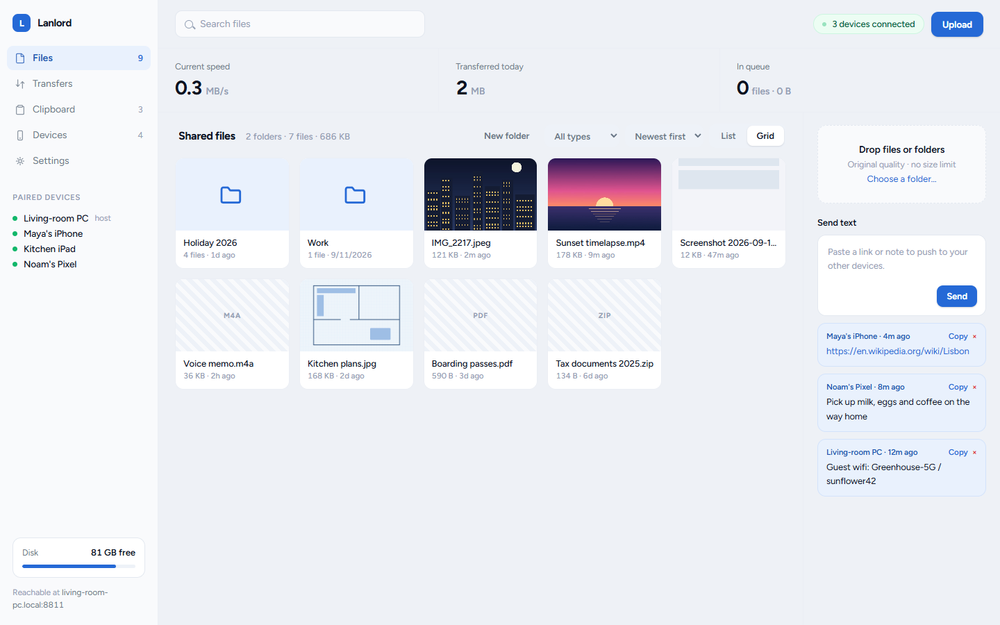
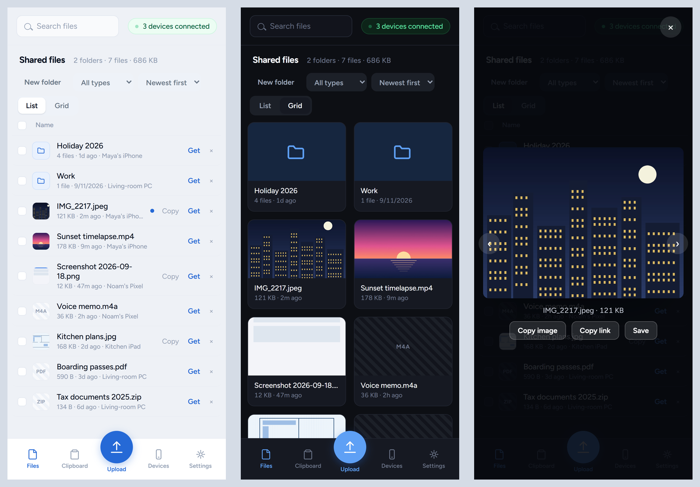
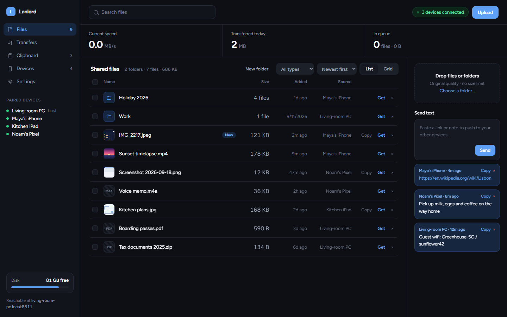

# Lanlord

**AirDrop for your Windows PC, plus a folder your phone can always reach.**

Send photos, videos and files between your iPhone (or Android) and your Windows PC over
your own wifi. No cable, no cloud, no account, and nothing to install on the phone: it's
a web page your PC serves, which you add to your Home Screen like an app.





- **Push, like AirDrop:** share from your phone and the file appears on the PC a moment later.
- **Pull, which AirDrop can't:** everything lands in one `shared` folder on the PC. From the
  couch, open Lanlord on your phone and grab any file in it, without touching the PC.
- **Stays in the house:** files go straight across your network and are stored as plain
  files on disk. Nothing is uploaded anywhere, and it works with no internet at all
  (e.g. on your PC's mobile hotspot).

## How it compares

|  | Lanlord | AirDrop | Cloud drives | LocalSend |
|---|---|---|---|---|
| iPhone ↔ Windows | ✅ | ❌ | ✅ | ✅ |
| Nothing to install on the phone | ✅ | ✅ | ❌ | ❌ |
| Files never leave your network | ✅ | ✅ | ❌ | ✅ |
| Original-quality video from iPhone | ✅ ¹ | ✅ | depends on settings | ✅ |
| A folder you can browse later, from any device | ✅ | ❌ | ✅ | ❌ |
| Works with no router | PC hotspot | ✅ | ❌ | ❌ |
| Send from the Share sheet | iPhone Shortcut | ✅ | ✅ | ✅ |

¹ iOS converts video when a web page picks it from the photo library. See
[Getting original quality from an iPhone](#getting-original-quality-from-an-iphone).

## Quick start

You need a Windows 10/11 PC with [Node.js 24](https://nodejs.org). Optional but
recommended:

- **ffmpeg** (`winget install Gyan.FFmpeg`): previews of iPhone HEVC/HEIC files in PC
  browsers that can't show them, turning MKV/AVI into phone-friendly MP4, and the
  **Compress** action.
- **Git for Windows**: brings `openssl`, which Lanlord uses to set up https (needed for
  **Copy image** and **Save to Photos** on the phone; see [below](#saving-and-copying-on-your-phone-https)).

```powershell
git clone https://github.com/donerfolk/Lanlord.git
cd Lanlord
npm install
npm start
```

The console prints the addresses to open, the **passcode**, and where it saved a QR code
(`connect-qr.png`).

### Keep it running (Windows service)

To have Lanlord start with Windows, run this once from **PowerShell as Administrator**
in the Lanlord folder:

```powershell
node install-service.js
```

After updating Lanlord, restart it with `Restart-Service lanlord.exe` (elevated).
Remove it with `node uninstall-service.js`.

## Connect your phone

1. Put the phone on the **same wifi** as the PC.
2. Scan `connect-qr.png` with the phone's camera. It opens Lanlord and unlocks it in one
   step: the passcode is part of the link.
3. In Safari: **Share → Add to Home Screen**. You now have a Lanlord app icon.

Later you can also reach it at `http://<your-pc-name>.local:8811`, which keeps working when
your PC's IP address changes. The **Settings** tab shows every address, the passcode, and
the QR code for pairing the next device.

## Send from the iPhone Share sheet (Shortcut)

The iPhone doesn't let web pages appear in its Share sheet, so Lanlord uses a Shortcut:

1. On your iPhone, add the [Lanlord Shortcut](https://www.icloud.com/shortcuts/ac3455b085b446b48faccb69faf5e2ad).
2. When it asks for your upload link, open Lanlord → **Settings → iPhone Shortcut** and
   tap the link to copy it.
3. From Photos, Files or any app: **Share → Lanlord**. The PC shows the file as it arrives.

## Getting original quality from an iPhone

Tested on an iPhone 15 Pro Max with a 4K HDR video (48 MB HEVC on the phone):

| How you send it | What arrives |
|---|---|
| Lanlord → Upload → Photo Library | ❌ 7 MB H.264 copy: iOS converts it before the page gets it |
| Share → Lanlord Shortcut | ❌ the same converted copy, **unless:** |
| Share → **Options → Current** → Lanlord Shortcut | ✅ the original, byte for byte |
| Photos → Save to Files, then Lanlord → Upload → Browse | ✅ the original |

iOS forgets the **Options → Current** choice after each share, so pick it every time you
want the original. Photos arrive at full resolution with their date and camera details on
every route; through Photo Library they arrive as JPEG rather than HEIC.

## On Android

Tested on a Samsung Galaxy S8 with Chrome:

- Photos and videos arrive as they were shot: full resolution, capture date, camera details
  and location.
- Chrome's photo picker renames photos to a long number (e.g. `1789844531191….jpg`). The
  date inside the photo is unchanged. Videos keep their names.
- Use the IP address or the QR code: Android often can't open `<pc-name>.local` addresses.
- **Get** saves into Chrome's Downloads folder. Google Photos lists it under device folders,
  not in the main photo grid.
- Lanlord only appears in Android's Share menu once it's installed from the **https**
  address (see below); over plain http, Chrome can only add a shortcut.

## Saving and copying on your phone (https)

Browsers only allow **Copy image** and **Save to Photos** on secure (https) pages, so
Lanlord also runs on **https, port 8812**, with a certificate it makes itself. Trust it
once on the phone:

1. On the phone: Lanlord → **Settings → Save & copy on this phone** →
   **Install the Lanlord certificate** → *Allow*. Then iOS **Settings → Profile
   Downloaded → Install**.
2. iOS **Settings → General → About → Certificate Trust Settings** → turn on
   **Lanlord CA**.
3. Open the `https://…` link shown in Lanlord's Settings and add *that* page to your
   Home Screen instead.

The certificate authority is valid for 10 years. The server certificate renews itself when
your PC's address changes, so this is a one-time job. The private keys stay in `certs/` on
your PC; never share that folder.

## What you can do



- **Upload** from the phone (Photo Library or Files), or drop files and whole folders onto
  the page on the PC. Paste a screenshot with Ctrl+V. Uploads can be paused, resumed and
  retried.
- **Folders:** create, open, rename, move (drag onto a folder or breadcrumb, or **Move to…**),
  and download as a zip.
- **Search** the whole share, **sort** and **filter** by type, **list** or **grid** view.
- **Select** many (shift-click for a range, Ctrl+A for all) to zip, move or delete them together.
- **Preview** photos, video and audio full-screen, with previous/next and **Copy link**.
- **Compress** a photo or video, with a live estimate of the new size. It never keeps a
  result that's bigger than the original.
- **Download as JPEG** (iPhone HEIC photos): a full-size JPEG copy with the date and camera
  details, for PCs that can't open HEIC. The original stays as it is.
- **Delete with Undo.** Deleted files wait a week in **Settings → Recently deleted**.
- **Send text:** push a link or note to your other devices and tap to copy it there.
- **Live updates:** files appear on every device the moment they arrive, including files
  you drop into the `shared` folder in File Explorer.
- **Devices** tab: see what's online, name your devices, forget old ones.
- **Phone gestures:** press and hold for the menu, swipe a row right to download, left to delete.
- **PC keyboard:** `/` search, `Esc` clear, `Ctrl+A` select all, `Delete` delete, arrow keys
  in the preview.
- **Light, dark or automatic** appearance, per device.
- MKV, AVI and similar videos are turned into MP4 automatically, so phones can play them.
  All audio tracks and text subtitles are kept, and the original goes to Recently deleted,
  unless the MP4 can't hold something in it (e.g. Blu-ray subtitles). In that case the
  original stays next to the MP4.

Everything lives in the `shared` folder as ordinary files, so File Explorer works on it too.

## Security

Lanlord is built for a home network you trust:

- Every device except the PC itself needs the **passcode** once. It's then remembered in a
  cookie. After 10 wrong tries from one address, that address is blocked for 10 minutes.
- To change the passcode, delete `auth.json` and restart (every device has to enter the new
  one), or set your own with `LANLORD_TOKEN`.
- Over plain http, files and the passcode cross your network unencrypted. Anyone who can
  watch your wifi traffic could see them. Use the https address if that matters to you.
- Uploaded files are served in a way that stops them running scripts inside Lanlord, and
  no request can reach files outside the `shared` folder.
- It is **not** meant to be exposed to the internet. For access from outside, use a VPN such
  as Tailscale rather than opening a port on your router.

## Troubleshooting

**The phone can't reach the PC**
- Are both on the same wifi? Guest networks and some mesh or hotel networks stop devices
  from seeing each other.
- Windows: **Settings → Network & internet → your wifi → Network profile type** must be
  **Private**. On **Public**, Windows Firewall blocks the phone.
- A VPN on the phone or PC can route the connection away from your home network. Pause it.
- If `http://<pc-name>.local:8811` doesn't load (common on Android), use the IP address
  shown in Settings or in the console.

**Everything asks for the passcode again:** the passcode was changed (see [Security](#security)),
or the browser cleared its cookies. Enter the passcode shown in the console or on the PC's
Settings tab.

**A video shows as black on the PC:** your browser can't decode it (HEVC often isn't
supported on PCs without the right graphics hardware). Lanlord makes a playable preview
automatically if ffmpeg is installed.

## Configuration

| Environment variable | Default | What it does |
|---|---|---|
| `LANLORD_PORT` | `8811` | http port |
| `LANLORD_HTTPS_PORT` | http port + 1 | https port |
| `LANLORD_TOKEN` | random, saved in `auth.json` | the passcode |
| `LANLORD_DIR` | `shared`, next to the code | the shared folder, absolute or relative to the Lanlord folder |
| `LANLORD_FFMPEG` | your own WinGet install (the service installer saves the path it found) | path to `ffmpeg.exe` |
| `LANLORD_OPENSSL` | found automatically | path to `openssl.exe` |
| `LANLORD_HOSTS` | none | extra names the PC may be reached by, comma-separated (e.g. `pc.lan`). Lanlord only answers to this PC's own name, `.local` name and IP addresses, so a page on another site can't pretend to be it |

## Development

- Start with [CONTRIBUTING.md](CONTRIBUTING.md): running a development copy without touching
  the one you use, the tests, the rules, and how to report a bug.
- `node selftest.js` runs the tests (also run on every push by GitHub Actions).
- To test without stopping the service, run a second copy on other ports:
  `$env:LANLORD_PORT=9911; node server.js`. It uses the same `shared` folder.
- [ARCHITECTURE.md](ARCHITECTURE.md) explains how the code is laid out.
- No build step: the whole front end is `public/index.html`.

## License

[MIT](LICENSE)
